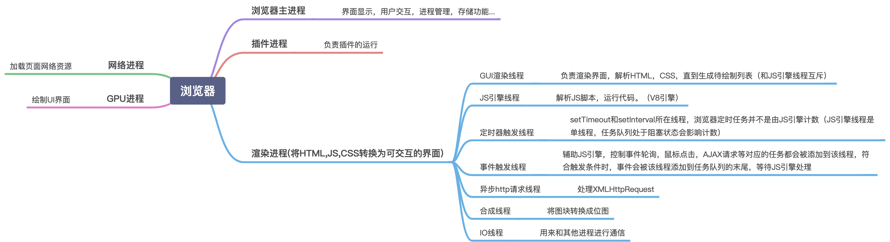
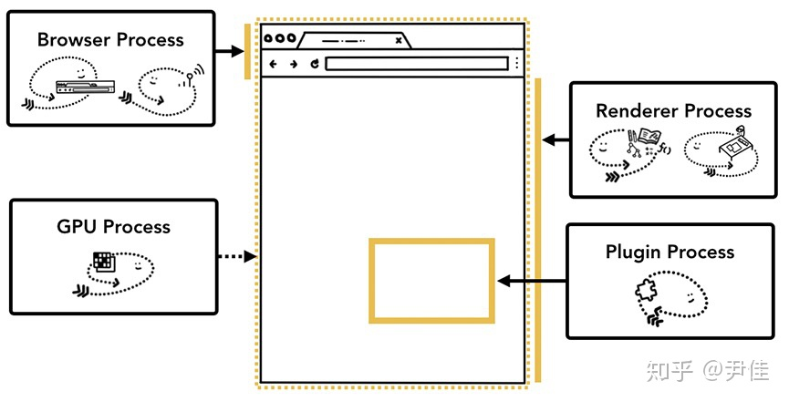
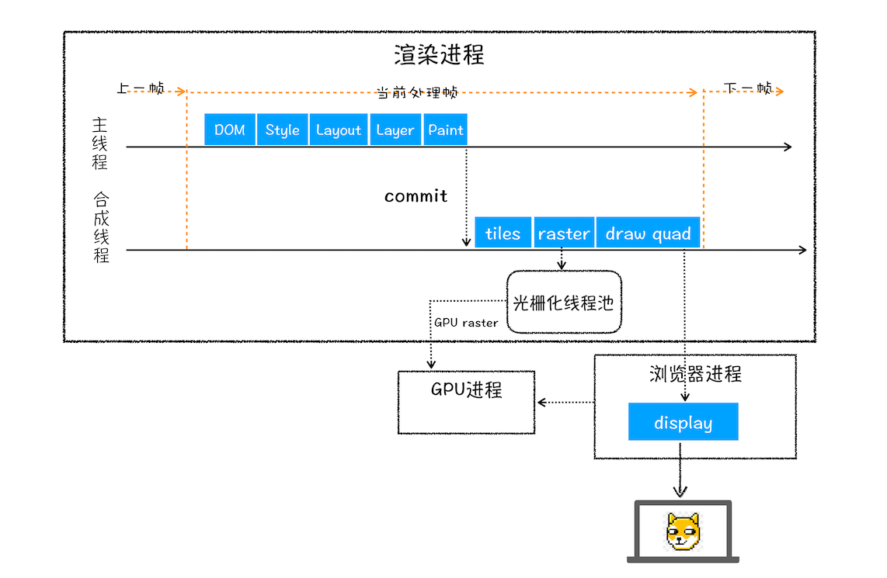
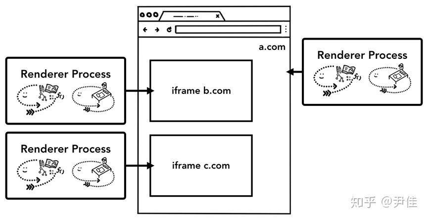

# 浏览器工作原理
## 一、现代浏览器

### 1. 现代浏览器的特征

- 网络
- 资源管理
- 网页浏览
- 多页面管理
- 插件和扩展
- 账号和同步
- 安全机制
- 开发者工具

### 2. 现代浏览器的结构

​			 				 				 


#### 1. 用户界面

#### 2. 浏览器引擎

在用户界面和渲染引擎之间传送指令

#### 3. 渲染引擎

#### 4. 网络

#### 5. JavaScript 解释器

用于解释和执行JavaScript代码

#### 6. XML 解析器

#### 7. 显示后端 Display Backend

用于绘制基本的窗口小部件，比如组合框和窗口。其公开了与平台无关的通用接口，而在底层使用操作系统的用户界面方法。

#### 8. 数据持久层

持久层，浏览器需要在硬盘上保存各种数据，cookie，网络数据库


## 二、渲染引擎

渲染引擎负责显示请求的内容，将HTML/CSS/JavaScript文本及相应的资源文件转换成图像结果。默认情况下，渲染引擎 可以显示HTML、XML文档与图片。通过插件可以显示其他内容。

| 渲染引擎            | 浏览器                            |
| ------------------- | --------------------------------- |
| Gecko               | Firefox                           |
| WebKit              | safari                            |
| Blink (webkit fork) | Chrome、Chromium、Opera、Edge(新) |
| Trident             | IE、Edge(旧)                      |

### 1. 渲染引擎工作流程

渲染引擎一开始会从网络层获取请求文档的内容，内容一般限制在 8kB以内。然后进行下面的基本流程，最终输出以可视化内容作为输出。


1. **解析HTML文档构建DOM树**

   渲染引擎使用 HTML parser 解析HTML文档，将各标记逐个转化成“Content Tree” 上面的DOM节点。

   

2. **构建渲染树**

   同时会解析外部CSS文件以及样式元素中的样式数据。HTML中这些带有视觉指令的样式信息将用于构建另一个树结构“Render Tree”。Render Tree包含多个带有视觉属性（如颜色和尺寸）的矩形。这些矩形的排列顺序就是他们将在屏幕上显示的顺序。

   ① 处理解析样式规则；②将css规则对应到对应的DOM节点

   

3. **布局**

   渲染树构建完毕，进入布局处理阶段。为每个节点分配一个应出现在屏幕上的确切坐标，判断显示在上层还是下层。

   

4. **绘制**

   渲染引擎遍历渲染树，由 显示后端 将每个节点绘制出来


这是一个渐进的过程，为达到更好的用户体验，渲染引擎力求尽快将内容显示在屏幕上。不必等到整个HTML解析完毕之后，就会开始构建渲染树和设置布局。在不断接收和处理来自网络的其他内容的同时，渲染引擎会将部分内容解析并显示出来。


### 2. 渲染引擎结构与工作流程


JS 会影响DOM树的结构，影响渲染树的渲染规则。

### 3. WebKit / Gecko 主流程


WebKit 和 Gecko 使用的术语略有不同，但是整体流程基本相同。

Gecko 将视觉格式化元素组成的数称为“框架树”（Frame Tree），每个元素都是框架。WebKit 使用的术语是“渲染树”（Render Tree），它由“呈现对象”组成。

对于元素的放置，WebKit使用的术语是“布局”（Layout），而Gecko称之为“重排”（Reflow）。

对于连接DOM节点和可视化信息从而创建渲染树的过程，WebKit使用的术语是“附加”（Attachment）。有个细微的非语义差别，就是Gecko在HTML和DOM树之间还有一个称为“内容槽”（Content Sink）的层，用于生成DOM元素。


## 三、Chrome 进程解析

Chrome 是多进程应用，不同进程负责浏览器UI的不同部分。



### 1. Chrome架构

Chrome 是多进程应用，不同进程负责浏览器UI的不同部分。




#### 1. 主进程 Browser Process

浏览器主进程负责协调、主控，只有一个。作用有:

- 负责浏览器界面显示，与用户交互。如前进，后退等
- 负责各个页面的管理，创建和销毁其他进程
- 网络资源的管理，下载等IO相关的操作

#### 2. 渲染器进程 Renderer Process

负责显示网站的选项卡内的所有内容。 

Chrome 浏览器一个域名使用一个渲染进程，使用同一个域名的多个标签页使用同一个进程。所以一个标签页卡死不会影响别的标签页工作，但是比较耗内存。

#### 3. 插件进程 Plugin Process

控制网站使用的所有插件，例如 flash。 

#### 4. GPU 进程

独立于其他进程的GPU处理任务，专用于处理 GPU 任务。 它被分成多个不同的进程，因为GPU处理来自多个程序的请求并将它们绘制在同一个页面中。

#### 5. 辅助进程 Utility Process

#### 浏览器多进程的优势

- 避免单个`page crash`影响整个浏览器
- 避免第三方插件`crash`影响整个浏览器
- 多进程充分利用多核优势
- 方便使用沙盒模型隔离插件等进程，提高浏览器稳定性

简单理解就是：如果浏览器是单进程的，某个`Tab`页崩溃了，就影响了整个浏览器，体验就会很差。同理如果是单进程的，插件崩溃了也会影响整个浏览器;
当然，内存等资源消耗也会更大，像空间换时间一样。

### 2. 浏览器内核

浏览器内核，即渲染进程，页面的渲染、js的执行、事件的循环都在这一进程内进行，也就是说，该进程下面拥有着多个线程，靠着这些现成共同完成渲染任务。那么这些线程是什么呢，如下：


#### 1. GUI 渲染线程

图形用户界面 GUI

负责渲染浏览器界面，包括解析HTML、CSS、构建DOM树、render 树、布局、绘制等。

当界面需要重绘(Repaint)，或由于某种操作引发回流(Reflow)时，该线程就会执行。


#### 2. JS引擎线程

JS 内核，也称为 JS 引擎，负责处理 JavaScript 脚本，如`V8`引擎。等待任务队列的任务到来，然后加以处理。一个`Tab`页（`render`进程）中无论什么时候都只有一个`JS`线程在运行`JS`程序。

##### 为什么JS引擎是单线程

JavaScript作为一门客户端的脚本语言，主要的任务是处理用户的交互，而用户的交互无非就是响应DOM的增删改，使用事件队列的形式，一次事件循环只处理一个事件响应，使得脚本执行相对连续。**如果JS引擎被设计为多线程的，那么DOM之间必然会存在资源竞争**，那么语言的实现会变得非常臃肿，在客户端跑起来，资源的消耗和性能将会是不太乐观的，故设计为单线程的形式，并附加一些其他的线程来实现异步的形式，这样运行成本相对于使用JS多线程来说降低了很多。

##### GUI渲染线程与JS引擎线程互斥

因为JS引擎可以修改DOM树，那么如果JS引擎在执行修改了DOM结构的同时，GUI线程也在渲染页面，那么这样就会导致渲染线程获取的DOM的元素信息可能与JS引擎操作DOM后的结果不一致。为了防止这种现象，GUI线程与JS线程需要设计为互斥关系，当JS引擎执行的时候，GUI线程会被挂起，但是GUI的渲染会被保存在一个队列当中，等待JS引擎空闲的时候执行渲染。
由此也可以推出，`JS`如果执行时间过长就会阻塞页面。如果JS引擎正在进行CPU密集型计算，那么JS引擎将会阻塞，长时间不空闲，导致渲染进程一直不能执行渲染，页面就会看起来卡顿卡顿的，渲染不连贯，所以，要尽量避免JS执行时间过长。

##### JS引擎线程与事件触发线程、定时触发器线程、异步HTTP请求线程

事件触发线程、定时触发器线程、异步HTTP请求线程三个线程有一个共同点，那就是使用回调函数的形式。当满足了特定的条件，这些回调函数会被执行。这些回调函数被浏览器内核理解成事件，在浏览器内核中拥有一个事件队列，这三个线程当满足了内部特定的条件，会将这些回调函数添加到事件队列中，等待JS引擎空闲执行。

例如异步HTTP请求线程，线程如果检测到请求的状态变更，如果设置有回调函数，回调函数会被添加事件队列中，等待JS引擎空闲了执行。

但是，JS引擎对事件队列（宏任务）与JS引擎内的任务（微任务）执行存在着先后循序，当每执行完一个事件队列的时间，JS引擎会检测内部是否有未执行的任务，如果有，将会优先执行（微任务）。


#### 3. 事件触发线程

听起来像JS的执行，但是其实归属于浏览器，而不是JS引擎，用来控制时间循环（可以理解，JS引擎自己都忙不过来，需要浏览器另开线程协助）。

当JS引擎执行代码块如setTimeout时，也可来自浏览器内核的其他线程,如鼠标点击、AJAX异步请求等，会将对应任务添加到事件线程中。

当对应的事件符合触发条件被触发时，该线程会把事件添加到待处理队列的队尾，等待JS引擎的处理。

注意：由于JS的单线程关系，所以这些待处理队列中的事件都得排队等待JS引擎处理（当JS引擎空闲时才会去执行）。


#### 4. 定时触发器线程

`setInterval` 与 `setTimeout` 所在线程。定时计时器并不是由JS引擎计时的，因为如果JS引擎是单线程的，如果JS引擎处于堵塞状态，那会影响到计时的准确。当计时完成被触发，事件会被添加到事件队列，等待JS引擎空闲了执行。

注意：W3C的HTML标准中规定， `setTimeout` 中小于 `4ms` 的时间间隔算为 `4ms` 。


#### 5. 异步HTTP请求线程

 `XMLHttpRequest` 在连接后新启动的一个线程。线程如果检测到请求的状态变更，如果设置有回调函数，该线程会把回调函数添加到事件队列。同理，等待JS引擎空闲了执行。


#### 6. Web Worker 子线程

创建 `Worker` 时，`JS` 引擎向浏览器申请开一个子线程（子线程是浏览器开的，完全受主线程控制，而且不能操作`DOM`）。
`JS`引擎线程 与 `worker`线程间通过特定的方式通信（`postMessage API`，需要通过序列化对象来与线程交互特定的数据）。

所以，如果有非常耗时的工作，请单独开一个`Worker`线程，这样里面不管如何翻天覆地都不会影响`JS`引擎主线程，只待计算出结果后，将结果通信给主线程即可


### 3. Browser主进程和浏览器内核（渲染进程）的通信过程

打开一个浏览器，可以看到：任务管理器出现了2个进程（一个主进程，一个是打开`Tab`页的渲染进程）。

1. `Browser主进程` 收到用户请求，首先需要获取页面内容（如通过网络下载资源），随后将该任务通过`RendererHost` 接口传递给 `Render渲染进程`
2. `Render渲染进程` 的`Renderer`接口收到消息，简单解释后，交给 `GUI渲染线程`，然后开始渲染
3.  `GUI渲染线程` 接收请求，加载网页并渲染网页，这其中可能需要 `Browser主进程` 获取资源和需要`GPU进程` 来帮助渲染
4. 当然可能会有`JS线程`操作`DOM`（这可能会造成回流并重绘）
5. 最后`Render渲染进程` 将结果传递给 `Browser主进程`
6. `Browser主进程` 接收到结果并将结果绘制出来 


### 4. 渲染流程

渲染器进程负责选项卡内发生的所有事情。 在渲染器进程中，主线程处理你为用户编写的大部分代码。如果有 JavaScript 代码是 web worker 或 service worker，那么会由 worker 线程来处理该部分代码。合成器线程(compositor)和栅格线程(raster)也在一个渲染器进程内部执行，来保证渲染页面平滑、高效。

渲染器进程的核心工作是把 HTML、CSS 和 JavaScript 加载至一个 web 页面中来供用户使用。





#### 1. 构建DOM 

当渲染器进程接收到导航的信息并开始接收 HTML 数据时，主线程就会开始解析文本字符（HTML）并把它转换成文档对象模型（DOM）。

DOM 是一个页面在浏览器内部的表示形式，也是一种 web 开发者可以通过 JavaScript 来操作的数据结构。


#### 2. 子资源加载 

一个网站通常会加载外部资源，如图片、CSS 和 JavaScript。这些文件需要从网络或缓存中读取。主线程在解析构建 DOM 时会在发现这些资源时一个个去请求，同时为了加快速度，“预加载扫描器”会并行运行。如果在 HTML 文档中有 `` 或 `<link>` 存在，预加载扫描器会查看在 HTML 解析器生成的令牌，并向浏览器进程中的网络线程发出请求。

注意: **JavaScript可以阻止解析**。根本原因是**GUI渲染线程与JS引擎线程互斥**

当 HTML 解析器遇到 `<script>` 标签时，它会暂停解析 HTML 文档并开始加载，解析，执行 JavaScript 代码。为什么呢？因为 JavaScript 能够通过 `document.write()` （该方法会改变整个 DOM 树结构）等方式来改变文档的内容。这就是 HTML 解析器为什么暂停并等待 JavaScript 执行后再恢复解析文档。如果对 JavaScript 执行过程好奇，可查看[JavaScript 引擎基础：Shapes 和 Inline Caches](https://www.keisei.top/V8-shapes-and-inline-cache)。


#### 3. 提示浏览器如何加载资源 

目前有许多方法帮助开发者提示浏览器如何加载资源更优雅。如果 JavaScript 代码中没有使用 `document.write()`，可以在 `<script>` 标签中添加 [`async`](https://developer.mozilla.org/en-US/docs/Web/HTML/Element/script#attr-async) 或 [`defer`](https://developer.mozilla.org/en-US/docs/Web/HTML/Element/script#attr-defer) 属性。浏览器会异步去加载、执行 Javscript 代码而不会阻塞解析 HTML。如果合适还可以使用 [JavaScript module](https://developers.google.com/web/fundamentals/primers/modules)。`<link rel="preload">` 会告诉浏览器这个资源在当前页面是绝对需要的，最好尽快下载下来。更多信息可查看[资源优先级加载](https://developers.google.com/web/fundamentals/performance/resource-prioritization)。


#### 4. 样式表计算 

只有 DOM 是不够知道页面究竟展示的样子的，因为我们可以对页面元素通过 CSS 来修饰。 主线程解析 CSS 并确定每一个 DOM 节点计算后的样式。每个节点的样式是通过 CSS 选择器来确定的。可以在开发者工具 `computed` 一栏查看每个节点的样式。


#### 5. 布局 

布局是寻找元素几何的过程。主线程遍历 DOM 树和样式来创建一个包含 x,y 轴和边框尺寸的布局树。布局树或许和 DOM 树很像，但是只包含在页面上显示的元素。如果有 `display: none` 的元素，那么不会存在于布局树（但 `visibility: hidden` 的元素会存在）。同样，如果有伪类如 `p::before{content: 'Hi!'}` 会出现在布局树中，尽管它不存在于 DOM 树


#### 6. 分层

绘制页面需要先构建 Render Layer Tree 以便用正确的顺序展示页面，这棵树的生成与 Render Object Tree 的构建同步进行。然后还要构建 Graphics Layer Tree 来避免不必要的绘制和使用硬件加速渲染，最终才能在屏幕上展示页面。

为了找到哪些元素需要位于哪些层，主线程遍历布局树来创建**层级树**（Layer Tree），层级树是渲染流水线后续流程的基础结构。如果页面的某部分应该是单独层（像抽屉菜单），可以通过 CSS `will-change` 属性告知浏览器。


#### 7. 绘制

有了 DOM样式，布局还是不能渲染一个页面。让我们来尝试创建一副画，我们知道了尺寸，形状和元素的位置，但是仍然需要知道以何种顺序来绘制它们。


在绘制这一步，主线程遍历布局树来生成绘制记录。绘制记录时绘制过程的记录如“先绘制背景，接着文本，然后是矩形”。如果有使用 JavaScript 在 `<canvas>` 元素上绘制过，这个过程会比较熟悉。


#### 8. 光栅化阶段（合成）

在浏览器知道了文档结构，每个元素的样式，页面的坐标，绘制顺序，那么是如何生成一个页面呢？把文档的结构、元素的样式、几何形状和绘制顺序转换为屏幕上的像素称为**光栅化**（rasterizing）。

光栅化就是按照绘制列表中的指令生成图片。每一个图层都对应一张图片，合成线程有了这些图片之后，会将这些图片合成为“一张”图片，并最终将生成的图片发送到后缓冲区。

**合成**是将一个页面分为许多层级，每层独立进行栅格化，并在一个被称为**合成器线程**的独立线程中合成为页面的技术。

一旦层级数创建好，绘制顺序也已确定，主线程就会提交信息到合成器线程。合成器线程对每层做栅格化操作。一个层可能像整个页面那么大，所以合成器线程会把每层都切分成方块，并把每块都发送至光栅线程。光栅线程栅格化每块方块并把它们存放在 GPU 内存中。


合成器线程可以对不同的栅格线程定义优先级，所以在视窗中（或靠近视窗）的部分可以先进行栅格化。

一旦方块都被栅格化，合成器线程收集称为 **draw quads** 的方块信息来创建一个 **Compositor frame**（合成帧）。

|                  |                                                              |
| ---------------- | ------------------------------------------------------------ |
| Draw quads       | 包含诸如方块在内存中的位置以及在考虑页面合成的情况下在页面中绘制方块的位置之类的信息。 |
| Compositor frame | 表示页面框架的四边形的集合。                                 |

一个合成帧随后通过 IPC (进程间通信机制)被提交至浏览器进程。此时，另一个合成帧可能由于浏览器 UI 的改变从 UI 线程被添加或从扩展的其他渲染器进程中添加。这些合成帧被发送至 GPU 来呈现到屏幕上。如果触发了一个滚动事件，合成器线程会创建另一个合成帧至 GPU。

合成的好处是不需要涉及到主线程。合成器线程不需要等待样式计算或 JavaScript 执行。如果布局或绘制需要重新计算就会涉及到主进程。


### 5. 站点隔离

站点隔离是 Chrome 最近引入的特性，为每个跨站点的 iframe 运行一个独立的渲染器进程。我们已经谈了为每个标签页分配一个渲染器进程的方式，这会允许跨站点的 iframes 运行在同一个渲染器进程中，从而可以在不同的站点间分享内存空间。运行 [http://a.com](https://link.zhihu.com/?target=http%3A//a.com) 和 [http://b.com](https://link.zhihu.com/?target=http%3A//b.com) 在同个渲染器进程看起来是没问题的，但[同源策略](https://link.zhihu.com/?target=https%3A//developer.mozilla.org/en-US/docs/Web/Security/Same-origin_policy)是Web核心的安全模型，它确保了一个网站不能在没有允许的情况下，获取其他网站的数据。避开这个策略是安全攻击的主要目标，而进程隔离是将站点分离最有效的方式。




支持站点隔离是多年工程努力的结果。站点隔离不是简单地（为不同站点）分配不同的渲染器进程，它从根本上改变了 iframe 互相通信的机制。在一个运行着 iframe 的页面打开 devtools ，意味着 devtools 需要实现底层的工作，才使得这些在不同渲染器进程的 iframe 达到无缝连接的效果。甚至是简单的 Ctrl + F 在页面中进行查找，搜索任务也需要跨越不同的渲染器进程才能完成。这就是为什么浏览器工程师们将站点隔离的发布称为一个重大的里程碑。


## 四、解析和DOM树构建

#### 1. 解析

解析文档是指将文档转化成有意义的结构，解析得到的结果通常是代表了文档结构的节点数，称作“解析树”或“文档树”。

解析是以文档所遵循的语法规则（编写文档所用的语言或格式）为基础的。所有可以解析的格式都必须对应确定的语法（由词汇和语法规则构成）。这称为[与上下文无关的语法](https://www.html5rocks.com/zh/tutorials/internals/howbrowserswork/#context_free_grammar)。如果语言的语法是与上下文无关的语法，就可以由常规解析器进行解析。与上下文无关的语法的直观定义就是可以完全用 BNF 格式表达的语法。

解析的过程可以分为两个过程：**词法分析** 和 **语法分析**。

词法分析是将输入内容分割成大量标记的过程。标记是语言中的词汇，即构成内容的单位。在人类语言中，它相当于语言字典中的单词。词法分析器知道如何将无关的字符（比如空格和换行符）分离出来。

语法分析是应用语言的语法规则的过程。语法通常使用一种称为 [BNF](http://en.wikipedia.org/wiki/Backus–Naur_Form) 的格式来定义。


##### 翻译 Translation

解析通常是在翻译过程中使用的，而翻译是指将输入文档转换成另一种格式。编译就是这样一个例子。编译器可将源代码编译成机器代码，具体过程是首先将源代码解析成解析树，然后将解析树翻译成机器代码文档。


有两种基本类型的解析器：**自上而下解析器**和**自下而上解析器**。直观地来说，自上而下的解析器从语法的高层结构出发，尝试从中找到匹配的结构。而自下而上的解析器从低层规则出发，将输入内容逐步转化为语法规则，直至满足高层规则。

有一些工具可以帮助您生成解析器，它们称为**解析器生成器**。您只要向其提供您所用语言的语法（词汇和语法规则），它就会生成相应的解析器。

WebKit 使用了两种非常有名的解析器生成器：用于创建词法分析器的 [Flex](http://en.wikipedia.org/wiki/Flex_lexical_analyser) 以及用于创建解析器的 [Bison](http://www.gnu.org/software/bison/)（您也可能遇到 Lex 和 Yacc 这样的别名）。Flex 的输入是包含标记的正则表达式定义的文件。Bison 的输入是采用 BNF 格式的语言语法规则。


#### 2. HTML 解析

**HTML解析器** 的任务是将 HTML 标记解析成解析树

解析器的输出“解析树”是由 DOM 元素和属性节点构成的树结构。DOM 是文档对象模型 (Document Object Model) 的缩写。它是 HTML 文档的对象表示，同时也是外部内容（例如 JavaScript）与 HTML 元素之间的接口。
解析树的根节点是“[Document](http://www.w3.org/TR/1998/REC-DOM-Level-1-19981001/level-one-core.html#i-Document)”对象。

HTML 的定义采用了 DTD（Document Type Definition，文档类型定义） 格式。此格式可用于定义 [SGML](http://en.wikipedia.org/wiki/Standard_Generalized_Markup_Language) 族的语言。它包括所有允许使用的元素及其属性和层次结构的定义。如上文所述，HTML DTD 无法构成与上下文无关的语法。

HTML 无法很容易地通过常规解析器解析（因为它的语法不是与上下文无关的语法），也无法通过 XML 解析器来解析。原因在于：

1. 语言的宽容本质
2. 浏览器历来对一些常见的无效 HTML 用法采取包容的态度
3. 解析过程需要不断的反复。源内容在解析过程中通常不会改变，但是在 HTML 中，脚本标记如果包含 `document.write`，就会添加额外的标记，这样解析过程实际上就更改了输入内容。

浏览器就创建了自定义的解析器来解析 HTML。[HTML5 规范详细地描述了解析算法](http://www.whatwg.org/specs/web-apps/current-work/multipage/parsing.html)。此算法由两个阶段组成：**标记化**和**树构建**。


**标记生成器** 识别标记，传递给**树构造器**，然后接受下一个字符以识别下一个标记；如此反复直到输入的结束。

**标记化** 是词法分析过程，将输入内容解析成多个标记。HTML标记包括起始标记、结束标记、属性名称、属性值。


##### 标记化算法  

该算法的输出结果是 HTML 标记。该算法使用状态机来表示。每一个状态接收来自输入信息流的一个或多个字符，并根据这些字符更新下一个状态。当前的标记化状态和树结构状态会影响进入下一状态的决定。这意味着，即使接收的字符相同，对于下一个正确的状态也会产生不同的结果，具体取决于当前的状态。

##### 树构建算法

在创建解析器的同时，也会创建 Document 对象。在树构建阶段，以 Document 为根节点的 DOM 树也会不断进行修改，向其中添加各种元素。标记生成器发送的每个节点都会由树构建器进行处理。规范中定义了每个标记所对应的 DOM 元素，这些元素会在接收到相应的标记时创建。这些元素不仅会添加到 DOM 树中，还会添加到开放元素的堆栈中。此堆栈用于纠正嵌套错误和处理未关闭的标记。其算法也可以用状态机来描述。这些状态称为“插入模式”。


##### 解析结束后的操作

在此阶段，浏览器会将文档标注为交互状态，并开始解析那些处于“deferred”模式的脚本，也就是那些应在文档解析完成后才执行的脚本。然后，文档状态将设置为“完成”，一个“加载”事件将随之触发。


##### 浏览器的容错机制

解析器必须具备一定的容错性。我们至少要能够处理以下错误情况：

1. 明显不能在某些外部标记中添加的元素。在此情况下，我们应该关闭所有标记，直到出现禁止添加的元素，然后再加入该元素。
2. 我们不能直接添加的元素。这很可能是网页作者忘记添加了其中的一些标记（或者其中的标记是可选的）。这些标签可能包括：HTML HEAD BODY TBODY TR TD LI（还有遗漏的吗？）。
3. 向 inline 元素内添加 block 元素。关闭所有 inline 元素，直到出现下一个较高级的 block 元素。
4. 如果这样仍然无效，可关闭所有元素，直到可以添加元素为止，或者忽略该标记。


> *我们只允许最多 20 层同类型标记的嵌套，如果再嵌套更多，就会全部忽略。*


#### 3. CSS 解析

WebKit 使用 [Flex 和 Bison](https://www.html5rocks.com/zh/tutorials/internals/howbrowserswork/#parser_generators) 解析器生成器，通过 CSS 语法文件自动创建解析器。Bison 会创建自下而上的移位归约解析器。Firefox 使用的是人工编写的自上而下的解析器。**这两种解析器都会将 CSS 文件解析成 *StyleSheet对象*，且每个对象都包含 CSS 规则。CSS 规则对象则包含*选择器*和*声明对象*，以及其他与 CSS 语法对应的对象。**


#### 4. 处理脚本和样式表的顺序

##### 脚本

网络的模型是同步的。网页作者希望解析器遇到` <script> `标记时立即解析并执行脚本。文档的解析将停止，直到脚本执行完毕。如果脚本是外部的，那么解析过程会停止，直到从网络同步抓取资源完成后再继续。此模型已经使用了多年，也在 HTML4 和 HTML5 规范中进行了指定。作者也可以将脚本标注为“defer”，这样它就不会停止文档解析，而是等到解析结束才执行。HTML5 增加了一个选项，可将脚本标记为异步，以便由其他线程解析和执行。

`<script src="" defer></script>`

`defer`属性被设定用来通知浏览器该脚本将在文档完成解析后，触发 `DOMContentLoaded` 事件前执行。有 `defer` 属性的脚本会阻止 `DOMContentLoaded` 事件，直到脚本被加载并且解析完成。

`<script src="" async></script>`

对于普通脚本，如果存在 `async` 属性，那么普通脚本会被并行请求，并尽快解析和执行。该属性能够消除解析阻塞的 Javascript。解析阻塞的 Javascript 会导致浏览器必须加载并且执行脚本，之后才能继续解析。`defer` 在这一点上也有类似的作用。


##### 预解析

WebKit 和 Firefox 都进行了这项优化。在执行脚本时，其他线程会解析文档的其余部分，找出并加载需要通过网络加载的其他资源。通过这种方式，资源可以在并行连接上加载，从而提高总体速度。请注意，预解析器不会修改 DOM 树，而是将这项工作交由主解析器处理；预解析器只会解析外部资源（例如外部脚本、样式表和图片）的引用。

<link> 标签的 `rel` 属性命名链接文档和当前文档的关系。[HTML链接类型](https://developer.mozilla.org/zh-CN/docs/Web/HTML/Link_types)

`rel=“preload”`  告诉浏览器下载资源，因为在当前导航期间稍后将需要该资源。

`rel=“prefetch”`  提示浏览器提前加载链接的资源，因为它可能会被用户请求。所以浏览器有可能通过事先获取和缓存对应资源，优化用户体验


##### 样式表

另一方面，样式表有着不同的模型。理论上来说，应用样式表不会更改 DOM 树，因此似乎没有必要等待样式表并停止文档解析。但这涉及到一个问题，就是脚本在文档解析阶段会请求样式信息。如果当时还没有加载和解析样式，脚本就会获得错误的回复，这样显然会产生很多问题。这看上去是一个非典型案例，但事实上非常普遍。Firefox 在样式表加载和解析的过程中，会禁止所有脚本。而对于 WebKit 而言，仅当脚本尝试访问的样式属性可能受尚未加载的样式表影响时，它才会禁止该脚本。


## 四、渲染树构建

在 DOM 树构建的同时，浏览器还会构建另一个树结构：渲染树。这是由可视化元素按照其显示顺序而组成的树，也是文档的可视化表示。它的作用是让您按照正确的顺序绘制内容。

Firefox 将渲染树中的元素称为“框架”。

WebKit 使用的术语是呈现器或呈现对象。呈现器知道如何布局并将自身及其子元素绘制出来。WebKits `RenderObject` 类是所有呈现器的基类。

```c++
class RenderObject{
    virtual void layout();
    virtual void paint(PaintInfo);
    virtual void rect repaintRect();
    Node* node; // the DOM node
    RenderStyle* style; // the computed style
    RenderLayer* containingLayer; // the containing z-index layer
}
```

每一个呈现器都代表了一个矩形的区域，通常对应于相关节点的 CSS 框，这一点在 CSS2 规范中有所描述。它包含诸如宽度、高度和位置等几何信息。框的类型会受到与节点相关的`display`样式属性的影响。元素类型也是考虑因素之一，例如表单控件和表格都对应特殊的框架。


下面这段 WebKit 代码描述了根据 display 属性的不同，针对同一个 DOM 节点应创建什么类型的呈现器。

```c++
RenderObject* RenderObject::createObject(Node* node, RenderStyle* style)
{
    Document* doc = node->document();
    RenderArena* arena = doc->renderArena();
    ...
    RenderObject* o = 0;

    switch (style->display()) {
        case NONE:
            break;
        case INLINE:
            o = new (arena) RenderInline(node);
            break;
        case BLOCK:
            o = new (arena) RenderBlock(node);
            break;
        case INLINE_BLOCK:
            o = new (arena) RenderBlock(node);
            break;
        case LIST_ITEM:
            o = new (arena) RenderListItem(node);
            break;
       ...
    }

    return o;
}
```


#### 渲染树 & DOM树

呈现器是和 DOM 元素相对应的，但并非一一对应。非可视化的 DOM 元素不会插入渲染树中，例如“head”元素。如果元素的 display 属性值为“none”，那么也不会显示在渲染树中（但是 visibility 属性值为“hidden”的元素仍会显示）。

有一些 DOM 元素对应多个可视化对象。它们往往是具有复杂结构的元素，无法用单一的矩形来描述。例如，“select”元素有 3 个呈现器：一个用于显示区域，一个用于下拉列表框，还有一个用于按钮。如果由于宽度不够，文本无法在一行中显示而分为多行，那么新的行也会作为新的呈现器而添加。

另一个关于多呈现器的例子是格式无效的 HTML。根据 CSS 规范，inline 元素只能包含 block 元素或 inline 元素中的一种。如果出现了混合内容，则应创建匿名的 block 呈现器，以包裹 inline 元素。

有一些呈现对象对应于 DOM 节点，但在树中所在的位置与 DOM 节点不同。浮动定位和绝对定位的元素就是这样，它们处于正常的流程之外，放置在树中的其他地方，并映射到真正的框架，而放在原位的是占位框架。


**初始容器 block 为“viewport”，而在 WebKit 中则为“RenderView”对象。**


#### 构建渲染树的流程

在 Firefox 中，渲染树中的元素称为“框架”，系统会针对 DOM 更新注册展示层，作为侦听器。展示层将框架创建工作委托给 `FrameConstructor`，由该构造器解析样式并创建框架。

在 WebKit 中，解析样式和创建呈现器的过程称为“附加”。每个 DOM 节点都有一个“attach”方法。附加是同步进行的，将节点插入 DOM 树需要调用新的节点“attach”方法。

处理 html 和 body 标记就会构建渲染树根节点。这个根节点呈现对象对应于 CSS 规范中所说的容器 block，这是最上层的 block，包含了其他所有 block。它的尺寸就是视口，即浏览器窗口显示区域的尺寸。Firefox 称之为 `ViewPortFrame`，而 WebKit 称之为 `RenderView`。这就是文档所指向的呈现对象。渲染树的其余部分以 DOM 树节点插入的形式来构建。


#### 样式计算

构建渲染树时，需要计算每一个呈现对象的可视化属性。这是通过计算每个元素的样式属性来完成的。

样式包括来自各种来源的样式表、inline 样式元素和 HTML 中的可视化属性（例如“bgcolor”属性）。其中后者将经过转化以匹配 CSS 样式属性。

样式表的来源包括浏览器的默认样式表、由网页作者提供的样式表以及由浏览器用户提供的用户样式表。


##### 1. 共享样式数据

WebKit 节点会引用 **样式对象** (`RenderStyle`)。这些对象在某些情况下可以由不同节点共享。这些节点是同级关系，并且：

1. 这些元素必须处于相同的鼠标状态（例如，不允许其中一个是“:hover”状态，而另一个不是）
2. 任何元素都没有 ID
3. 标记名称应匹配
4. 类属性应匹配
5. 映射属性的集合必须是完全相同的
6. 链接状态必须匹配
7. 焦点状态必须匹配
8. 任何元素都不应受属性选择器的影响，这里所说的“影响”是指在选择器中的任何位置有任何使用了属性选择器的选择器匹配
9. 元素中不能有任何 inline 样式属性
10. 不能使用任何同级选择器。WebCore 在遇到任何同级选择器时，只会引发一个全局开关，并停用整个文档的样式共享（如果存在）。这包括 + 选择器以及 :first-child 和 :last-child 等选择器。


##### 2. 对规则进行处理以简化匹配

样式表解析完毕后，系统会根据选择器将 CSS 规则添加到某个哈希表中。这些哈希表的选择器各不相同，包括 ID、类名称、标记名称等，还有一种通用哈希表，适合不属于上述类别的规则。如果选择器是 ID，规则就会添加到 ID 表中；如果选择器是类，规则就会添加到类表中，依此类推。这种处理可以大大简化规则匹配。我们无需查看每一条声明，只要从哈希表中提取元素的相关规则即可。WebKit 和 Firefox 都进行了这一优化处理。

我们以如下的样式规则为例：

```
p.error {color:red}
#messageDiv {height:50px}
div {margin:5px}
```

第一条规则将插入类表，第二条将插入 ID 表，而第三条将插入标记表。
对于下面的 HTML 代码段：

```
<p class="error">an error occurred </p>
<div id="messageDiv">this is a message</div>
```


我们首先会为 p 元素寻找匹配的规则。类表中有一个“error”键，在下面可以找到“p.error”的规则。div 元素在 ID 表（键为 ID）和标记表中有相关的规则。剩下的工作就是找出哪些根据键提取的规则是真正匹配的了。
例如，如果 div 的对应规则如下：

```
table div {margin:5px}
```

这条规则仍然会从标记表中提取出来，因为键是最右边的选择器，但这条规则并不匹配我们的 div 元素，因为 div 没有 table 祖先。


##### 3. 样式表层叠顺序

某个样式属性的声明可能会出现在多个样式表中，也可能在同一个样式表中出现多次。这意味着应用规则的顺序极为重要。这称为“层叠”顺序。根据 CSS2 规范，层叠的顺序为（优先级从低到高）：

1. 浏览器声明
2. 用户普通声明
3. 作者普通声明
4. 作者重要声明
5. 用户重要声明

浏览器声明是重要程度最低的，而用户只有将该声明标记为“重要”才可以替换网页作者的声明。同样顺序的声明会根据 **Specificity （特异性/优先级）** 进行排序，然后再是其指定顺序。

HTML 可视化属性会转换成匹配的 CSS 声明。它们被视为低优先级的网页作者规则。


##### 4. 选择器的优先级

优先级就是分配给指定的 CSS 声明的一个权重，它由 匹配的选择器中的 每一种选择器类型的 数值 决定。而当优先级与多个 CSS 声明中任意一个声明的优先级相等的时候，CSS 中最后的那个声明将会被应用到元素上。

选择器的优先级由 [CSS2 规范](http://www.w3.org/TR/CSS2/cascade.html#specificity)定义如下：

- 如果声明来自于“style”属性，而不是带有选择器的规则，则记为 1，否则记为 0 (= a)
- 记为选择器中 ID 属性的个数 (= b)
- 记为选择器中其他属性（类选择器）和伪类的个数 (= c) 
- 记为选择器中元素名称和伪元素的个数 (= d)

将四个数字按 a-b-c-d 这样连接起来（位于大数进制的数字系统中），构成特异性。


```css
 *             {}  /* a=0 b=0 c=0 d=0 -> specificity = 0,0,0,0 */
 li            {}  /* a=0 b=0 c=0 d=1 -> specificity = 0,0,0,1 */
 li:first-line {}  /* a=0 b=0 c=0 d=2 -> specificity = 0,0,0,2 */
 ul li         {}  /* a=0 b=0 c=0 d=2 -> specificity = 0,0,0,2 */
 ul ol+li      {}  /* a=0 b=0 c=0 d=3 -> specificity = 0,0,0,3 */
 h1 + *[rel=up]{}  /* a=0 b=0 c=1 d=1 -> specificity = 0,0,1,1 */
 ul ol li.red  {}  /* a=0 b=0 c=1 d=3 -> specificity = 0,0,1,3 */
 li.red.level  {}  /* a=0 b=0 c=2 d=1 -> specificity = 0,0,2,1 */
 #x34y         {}  /* a=0 b=1 c=0 d=0 -> specificity = 0,1,0,0 */
 style=""          /* a=1 b=0 c=0 d=0 -> specificity = 1,0,0,0 */
```


#### 渐进式处理

WebKit 使用一个标记来表示是否所有的顶级样式表（包括 @imports）均已加载完毕。如果在附加过程中尚未完全加载样式，则使用占位符，并在文档中进行标注，等样式表加载完毕后再重新计算。


## 五、布局 

呈现器在创建完成并添加到渲染树时，并不包含位置和大小信息。计算这些值的过程称为**布局layout**或**重排reflow**。

HTML 采用基于流的布局模型，这意味着大多数情况下只要一次遍历就能计算出几何信息。处于流中靠后位置元素通常不会影响靠前位置元素的几何特征，因此布局可以按从左至右、从上至下的顺序遍历文档。但是也有例外情况，比如 HTML 表格的计算就需要不止一次的遍历 。

坐标系是相对于根框架而建立的，使用的是上坐标和左坐标。

布局是一个递归的过程。它从根呈现器（对应于 HTML 文档的 `<html>` 元素）开始，然后递归遍历部分或所有的框架层次结构，为每一个需要计算的呈现器计算几何信息。

根呈现器的位置左边是 `0,0`，其尺寸为视口（也就是浏览器窗口的可见区域）。

所有的呈现器都有一个`layout`或者`reflow`方法，每一个呈现器都会调用其需要进行布局的子代的 `layout` 方法。


#### Dirty 位系统

为避免对所有细小更改都进行整体布局，浏览器采用了一种“dirty 位”系统。如果某个呈现器发生了更改，或者将自身及其子代标注为“dirty”，则需要进行布局。

有两种标记：“dirty”和“children are dirty”。“children are dirty”表示尽管呈现器自身没有变化，但它至少有一个子代需要布局。


#### 全局布局和增量布局

全局布局是指触发了整个渲染树范围的布局，触发原因可能包括：

1. 影响所有呈现器的全局样式更改，例如字体大小更改。
2. 屏幕大小调整。

布局可以采用增量方式，也就是只对 dirty 呈现器进行布局（这样可能存在需要进行额外布局的弊端）。当呈现器为 dirty 时，会异步触发增量布局。例如，当来自网络的额外内容添加到 DOM 树之后，新的呈现器附加到了渲染树中。


#### 异步布局和同步布局

增量布局是异步执行的。Firefox 将增量布局的“reflow 命令”加入队列，而调度程序会触发这些命令的批量执行。WebKit 也有用于执行增量布局的计时器：对渲染树进行遍历，并对 dirty 呈现器进行布局。

请求样式信息（例如“offsetHeight”）的脚本可同步触发增量布局。

全局布局往往是同步触发的。

有时，当初始布局完成之后，如果一些属性（如滚动位置）发生变化，布局就会作为回调而触发。


#### 优化

如果布局是由“大小调整”或呈现器的位置（而非大小）改变而触发的，那么可以从缓存中获取呈现器的大小，而无需重新计算。

在某些情况下，只有一个子树进行了修改，因此无需从根节点开始布局。这适用于在本地进行更改而不影响周围元素的情况，例如在文本字段中插入文本（否则每次键盘输入都将触发从根节点开始的布局）。


#### 布局处理

布局通常具有以下模式：

1. 父呈现器确定自己的宽度。
2. 父呈现器依次处理子呈现器，并且：
   1. 放置子呈现器（设置 x,y 坐标）。
   2. 如果有必要，调用子呈现器的布局（如果子呈现器是 dirty 的，或者这是全局布局，或出于其他某些原因），这会计算子呈现器的高度。
3. 父呈现器根据子呈现器的累加高度以及边距和补白的高度来设置自身高度，此值也可供父呈现器的父呈现器使用。
4. 将其 dirty 位设置为 false。


Firefox 使用“state”对象 (nsHTMLReflowState) 作为布局的参数（称为“reflow”），这其中包括了父呈现器的宽度。Firefox 布局的输出为“metrics”对象 (nsHTMLReflowMetrics)，其包含计算得出的呈现器高度。


#### 宽度计算

呈现器宽度是根据容器块的宽度、呈现器样式中的“width”属性以及边距和边框计算得出的。
例如以下 div 的宽度：

```
<div style="width:30%"/>
```

将由 WebKit 计算如下（BenderBox 类，calcWidth 方法）：

- 容器的宽度取容器的 availableWidth 和 0 中的较大值。availableWidth 在本例中相当于 contentWidth，计算公式如下：

  ```
  clientWidth() - paddingLeft() - paddingRight()
  ```

  clientWidth 和 clientHeight 表示一个对象的内部（除去边框和滚动条）。

- 元素的宽度是“width”样式属性。它会根据容器宽度的百分比计算得出一个绝对值。

- 然后加上水平方向的边框和补白。

现在计算得出的是“preferred width”。然后需要计算最小宽度和最大宽度。如果首选宽度大于最大宽度，那么应使用最大宽度。如果首选宽度小于最小宽度（最小的不可破开单位），那么应使用最小宽度。这些值会缓存起来，以用于需要布局而宽度不变的情况。


#### 换行

如果呈现器在布局过程中需要换行，会立即停止布局，并告知其父代需要换行。父代会创建额外的呈现器，并对其调用布局。


## 六、绘制

在绘制阶段，系统会遍历渲染树，并调用呈现器的 `paint` 方法，将呈现器的内容显示在屏幕上。绘制工作是使用用户界面基础组件完成的。


#### 全局绘制和增量绘制 (Global and incremental)

和布局一样，绘制也分为全局（绘制整个渲染树）和增量两种。

在增量绘制中，部分呈现器发生了更改，但是不会影响整个树。更改后的呈现器将其在屏幕上对应的矩形区域设为无效，这导致 OS 将其视为一块“dirty 区域”，并生成“paint”事件。OS 会很巧妙地将多个区域合并成一个。

在 Chrome 浏览器中，情况要更复杂一些，因为 Chrome 浏览器的呈现器不在主进程上。Chrome 浏览器会在某种程度上模拟 OS 的行为。展示层会侦听这些事件，并将消息委托给呈现根节点。然后遍历渲染树，直到找到相关的呈现器，该呈现器会重新绘制自己（通常也包括其子代）。

#### 绘制顺序

[CSS2 规范定义了绘制流程的顺序](http://www.w3.org/TR/CSS21/zindex.html)。绘制的顺序其实就是元素进入 **堆栈样式上下文** 的顺序。这些堆栈会从后往前绘制，因此这样的顺序会影响绘制。块呈现器的堆栈顺序如下：

1. 背景颜色
2. 背景图片
3. 边框
4. 子代
5. 轮廓

#### WebKit 矩形存储

在重新绘制之前，WebKit 会将原来的矩形另存为一张位图，然后只绘制新旧矩形之间的差异部分


## 七、分层和合成


通常页面的组成是非常复杂的，有的页面里要实现一些复杂的动画效果，比如点击菜单时弹出菜单的动画特效，滚动鼠标滚轮时页面滚动的动画效果，当然还有一些炫酷的 3D 动画特效。如果没有采用分层机制，从布局树直接生成目标图片的话，那么每次页面有很小的变化时，都会触发重排或者重绘机制，这种“牵一发而动全身”的绘制策略会严重影响页面的渲染效率。为了提升每帧的渲染效率，Chrome 引入了分层和合成的机制。

你可以把一张网页想象成是由很多个图片叠加在一起的，每个图片就对应一个图层，Chrome 合成器最终将这些图层合成了用于显示页面的图片。如果你熟悉 PhotoShop 的话，就能很好地理解这个过程了，PhotoShop 中一个项目是由很多图层构成的，每个图层都可以是一张单独图片，可以设置透明度、边框阴影，可以旋转或者设置图层的上下位置，将这些图层叠加在一起后，就能呈现出最终的图片了。

在这个过程中，将素材分解为多个图层的操作就称为**分层**，最后将这些图层合并到一起的操作就称为**合成**。所以，分层和合成通常是一起使用的。


### 图层树

在 Chrome 的渲染流水线中，**分层体现在生成布局树之后，渲染引擎会根据布局树的特点将其转换为层树（Layer Tree）**，层树是渲染流水线后续流程的基础结构。

Render Layer 是在 Render Object 创建的同时生成的，具有相同坐标空间的 Render Object 属于同一个 Render Layer。这棵树主要用来实现层叠上下文，以保证用正确的顺序合成页面。


有了绘制列表之后，就需要进入光栅化阶段了，**光栅化就是按照绘制列表中的指令生成图片。每一个图层都对应一张图片，合成线程有了这些图片之后，会将这些图片合成为“一张”图片，并最终将生成的图片发送到后缓冲区**。这就是一个大致的分层、合成流程。

**合成操作是在合成线程compositor thread上完成的**，不需要涉及到主线程。合成器线程不需要等待样式计算或 JavaScript 执行。如果布局或绘制需要重新计算就会涉及到主进程。这就是为什么经常主线程卡住了，但是 CSS 动画依然能执行的原因。


浏览器的页面实际上被分成了很多图层，这些图层叠加后合成了最终的页面。

我们来看看图层与布局树之间关系，如下图。通常情况下，**并不是布局树的每个节点都包含一个图层，如果一个节点没有对应的层，那么这个节点就从属于父节点的图层。**


Chrome 拥有两套不同的渲染路径(rendering path)：硬件加速路径和旧软件路径(older software path)

在 Chrome 中其实有几种不同的层类型：

- `Render Layers` 渲染层，这是负责对应 DOM 子树
- `Graphics Layers` 图形层，这是负责对应 RenderLayers子树。


### 渲染层（RenderLayer）

一个 DOM 节点对应了一个**渲染对象**，渲染对象依然维持着 DOM 树的树形结构。一个渲染对象知道如何绘制一个 DOM 节点的内容，它通过向一个绘图上下文（GraphicsContext）发出必要的绘制调用来绘制 DOM 节点。

渲染层是浏览器渲染期间构建的第一个层模型，处于相同坐标空间（z轴空间）的渲染对象，都将归并到同一个渲染层中，因此根据层叠上下文，不同坐标空间的的渲染对象将形成多个渲染层，以体现它们的层叠关系。

所以，对于满足形成**层叠上下文**条件的渲染对象，浏览器会自动为其创建新的渲染层。


#### 创建新的渲染层的情况：

层叠上下文也基本上是有一些特定的CSS属性创建的，包括以下几类常见的情况：

- 有明确的定位属性（relative、fixed、sticky、absolute）
- opacity < 1
- 有 CSS fliter 滤镜属性
- 有 CSS mask 遮罩属性
- 有 CSS mix-blend-mode 属性且值不为 normal
- 有 CSS transform 属性且值不为 none
- backface-visibility 属性为 hidden
- 有 CSS reflection 属性
- 有 CSS column-count 属性且值不为 auto或者有 CSS column-width 属性且值不为 auto
- 当前有对于 opacity、transform、fliter、backdrop-filter 应用动画
- overflow 不为 visible

另外以下 DOM 元素对应的 Render Object 也会创建单独的 Render Layer：

- `Document`
- `HTML`
- `Canvas`
- `Video`

DOM 节点和渲染对象是一一对应的，满足以上条件的渲染对象就能拥有独立的渲染层。当然这里的独立是不完全准确的，并不代表着它们完全独享了渲染层，由于不满足上述条件的渲染对象将会与其第一个拥有渲染层的父元素共用同一个渲染层，因此实际上，这些渲染对象会与它的部分子元素共用这个渲染层。


### 图形层（GraphicsLayer）

GraphicsLayer 其实是一个负责生成最终准备呈现的内容图形的层模型，它拥有一个图形上下文（GraphicsContext），GraphicsContext 会负责输出该层的位图。存储在共享内存中的位图将作为纹理(texture)上传到 GPU，最后由 GPU 将多个位图进行合成，然后绘制到屏幕上，此时，我们的页面也就展现到了屏幕上。

所以 **GraphicsLayer 是一个重要的渲染载体和工具，但它并不直接处理渲染层，而是处理合成层**。

Chrome 使用纹理来从 GPU上获得大块的页面内容。通过将纹理应用到一个非常简单的矩形网格就能很容易匹配不同的位置 (position) 和变形 (transformation)。这也就是3D CSS 的工作原理，它对于快速滚动也十分有效。


### 合成层（CompositingLayer）

满足某些特殊条件的渲染层，会被浏览器自动提升为合成层，合成层拥有单独的 `GraphicsLayer`，而其他不是合成层的渲染层，则和其第一个拥有 GraphicsLayer 父层共用一个。

一旦renderLayer提升为了合成层就会有自己的绘图上下文，并且会开启 **硬件加速**。

GPU中，各个复合图层是单独绘制的，互不影响。可以通过硬件加速的方式，声明一个新的复合图层，它会单独分配资源。当然也会脱离普通文档流，这样一来，不管这个复合图层中怎么变化，也不会影响默认复合层里的回流重绘。但是尽量不要大量使用复合图层，否则由于资源消耗过度，页面反而会变的更卡。

普通文档流内可以理解为一个合成层，这是默认合成层，里面不管添加多少元素，其实都是在同个合成层中。`absolute`布局、`fixed` 布局，虽然可以脱离文档流，但它仍然属于默认合成层。


#### 提升合成层的条件：

那么一个渲染层满足哪些特殊条件时，才能被提升为合成层呢？这里列举了一些常见的情况：

- 3D transforms：translate3d、translateZ 等
- video、canvas、iframe 等元素
- 通过 Element.animate() 实现的 opacity 动画转换
- 通过 СSS 动画实现的 opacity 动画转换
- position: fixed
- 具有 will-change 属性
- 对 opacity、transform、fliter、backdropfilter 应用了 animation 或者 transition


这里值得注意的是，不少人会将这些合成层的条件和渲染层产生的条件混淆，这两种条件发生在两个不同的层处理环节，是完全不一样的。


#### 隐式合成

上边提到，满足某些显性的特殊条件时，渲染层会被浏览器提升为合成层。除此之外，在浏览器的 Composite 阶段，还存在一种隐式合成，部分渲染层在一些特定场景下，会被默认提升为合成层。

对于隐式合成，[CSS GPU Animation](https://www.smashingmagazine.com/2016/12/gpu-animation-doing-it-right/) 中是这么描述的：

> This is called implicit compositing: One or more non-composited elements that should appear above a composited one in the stacking order are promoted to composite layers. 
>
> 一个或多个非合成元素应出现在堆叠顺序上的合成元素之上，被提升到合成层。


`z-index` 比较低的节点会提升为一个单独的视图层，那么层叠等级比它高的节点**都会**成为一个独立的图层。

如果a是一个复合层，而且b在a上面，那么b也会被隐式转为一个复合图层，这点需要特别注意。

**缺点：** 根据上面的文章来说，在一个大型的项目中，一个`z-index`比较低的节点被提升为单独图层后，层叠在它上面的元素统统都会提升为单独的图层，我们知道，上千个图层，会增大内存的压力，有时候会让页面崩溃。这就是 **层爆炸** 。


#### 层爆炸

由于某些原因可能导致产生大量不在预期内的合成层，虽然有浏览器的**层压缩**机制，但是也有很多无法进行压缩的情况，这就可能出现层爆炸的现象（简单理解就是，很多不需要提升为合成层的元素因为某些不当操作成为了合成层）。

解决层爆炸的最佳方案是打破 overlap 的条件，也就是说让其他元素不要和合成层元素重叠。简单直接的方式：**使用硬件加速时，尽可能的使用 `z-index`，防止浏览器默认给后续的元素创建复合层渲染。**

具体的原理是：webkit CSS3 中，如果这个元素添加了硬件加速，并且 `z-index`层级比较低，那么在这个元素的后面其它元素（层级比这个元素高或者相同的，并且 `relective` 或 `absolute` 属性相同的），会默认变为复合层渲染，如果处理不当会极大的影响性能。


例子：http://fouber.github.io/test/layer/

开启 dev tools 中的 Rendering 的Layer borders后， 观察点击`为动画元素设置z-index复选框`的页面提示变化


页面中设置了一个 h1 标题，应用了 translate3d 动画，使得它被放到 composited layer 中渲染，然后在这个元素后面创建了2000个list。由于 animation transform 的特殊性（动态交叠不确定），隐式合成在不需要交叠的情况下也能发生，就导致了页面中所有 `z-index` 高于它的节点所对应的渲染层全部提升为合成层，使得本不需要提升到合成层的 ul 元素下的每个 li 元素都提升为一个单独合成层（每个li元素的黄色提示边框），最终会导致GPU资源过度消耗页面滑动时很卡，尤其在移动端（安卓）上更加明显。

为动画元素设置 `z-index` 后，可以看出ul下的每个li都回归到普通渲染层，不再是合成层也就不会消耗GPU资源去渲染，从而达到了优化页面性能优化的目的。


### 层合成的利弊


#### 利用合成层优化性能

一旦 渲染层（renderLayer） 提升为了合成层就会有自己的绘图上下文，并且会开启硬件加速，有利于性能提升。里面列举了一些特点：

- 合成层的位图，会交由 GPU 合成，比 CPU 处理要快
- 当需要 repaint 时，只需要 repaint 本身，不会影响到其他的层
- 元素提升为合成层后，transform 和 opacity 才不会触发 repaint，如果不是合成层，则其依然会触发 repaint。


一般一个元素开启硬件加速后会变成合成层，可以独立于普通文档流中，改动后可以避免整个页面重绘，提升性能。

1. 提升动画效果的元素 合成层的好处是不会影响到其他元素的绘制，因此，为了减少动画元素对其他元素的影响，从而减少paint，我们需要把动画效果中的元素提升为合成层。 提升合成层的最好方式是使用 CSS 的 `will-change` 属性。从上一节合成层产生原因中，可以知道 `will-change`  设置为 `opacity`、`transform`、`top`、`left`、`bottom`、`right` 可以将元素提升为合成层。
2. 使用 `transform` 或者 `opacity` 来实现动画效果，这样只需要做合成层的合并就好了。
3. 减少绘制区域 对于不需要重新绘制的区域应尽量避免绘制，以减少绘制区域，比如一个 `fix` 在页面顶部的固定不变的导航header，在页面内容某个区域 repaint 时，整个屏幕包括 fix 的 header 也会被重绘。而对于固定不变的区域，我们期望其并不会被重绘，因此可以通过之前的方法，将其提升为独立的合成层。减少绘制区域，需要仔细分析页面，区分绘制区域，减少重绘区域甚至避免重绘。


#### 合成层的坑

##### 1. 传输慢

绘制的图层必须传输到 GPU，这些层的数量和大小达到一定量级后，可能会导致传输非常慢，进而导致一些低端和中端设备上出现闪烁

##### 2. 合成层占用内存的问题

隐式合成容易产生过量的合成层，每个合成层都占用额外的内存，而内存是移动设备上的宝贵资源，过多使用内存可能会导致浏览器崩溃，让性能优化适得其反。


#### `absolute` 和硬件加速的区别

`absolute` 虽然可以脱离普通文档流，但是无法脱离默认复合层。

所以，就算 `absolute` 中信息改变时不会改变普通文档流中 `render` 树，但是，浏览器最终绘制时，是整个复合层绘制的，所以 `absolute` 中信息的改变，仍然会影响整个复合层的绘制。浏览器会重绘它，如果复合层中内容多，`absolute`带来的绘制信息变化过大，资源消耗是非常严重的。 `absolute` 改变会重绘不会重排。

而硬件加速直接就是在另一个复合层了（另起炉灶），所以它的信息改变不会影响默认复合层（当然了，内部肯定会影响属于自己的复合层），仅仅是引发最后的合成（输出视图）。


#### Chrome Devtools 如何查看合成层

我们需要权衡利害，合理组织页面的合成层，规避层合成对页面造成的负面影响。这就要求我们事先要对页面的层合成情况有一个详细的了解。Chrome Devtools 给我们提供了一些工具，可以方便的查看页面的合成层情况。

1.  点击 `More tools -> Rendering`，选择 `Layer borders`，你就能看到页面中的合成层都带上了黄色边框。

2.  需要更加详尽的层合成情况，点击 `More tools -> Layers`，开发工具左侧列出了所有提升为独立合成层的元素，右侧则是一个整体合成层边界视图，以及选定合成层的详细情况，包括以下几个比较关键的信息：

   - Size：合成层的大小，其实也就是对应元素的尺寸；
   - Compositing Reasons：形成复合层原因，这是最关键的，也是我们分析问题的突破口，比如图中的合成层产生的原因就是交叠问题；
   - Memory estimate：内存占用估算；
   - Paint count：绘制次数；
   - Slow scroll regions：缓慢滚动区域。

   

#### 一些优化建议

##### 1、动画使用 transform 实现

对于一些体验要求较高的关键动画，比如一些交互复杂的玩法页面，存在持续变化位置的 animation 元素，我们最好是使用 transform 来实现而不是通过改变 left/top 的方式。这样做的原因是，如果使用 left/top 来实现位置变化，animation 节点和 Document 将被放到了同一个 GraphicsLayer 中进行渲染，持续的动画效果将导致整个 Document 不断地执行重绘，而使用 transform 的话，能够让 animation 节点被放置到一个独立合成层中进行渲染绘制，动画发生时不会影响到其它层。并且另一方面，动画会完全运行在 GPU 上，相比起 CPU 处理图层后再发送给显卡进行显示绘制来说，这样的动画往往更加流畅。

##### 2、减少隐式合成

虽然隐式合成从根本上来说是为了保证正确的图层重叠顺序，但具体到实际开发中，隐式合成很容易就导致一些无意义的合成层生成，归根结底其实就要求我们在开发时约束自己的布局习惯，避免踩坑。

比如上边提到的栏目页面，就因为平时开发的不注意造成页面生成了过多的合成层，我在试图查看页面合成层情况的时候，在 PC 上已经能明显感到卡顿了。利用 Chrome Devtools 分析之后不难发现，页面里边存在的一个带动画 transform 的 button 按钮，提升为了合成层，动画交叠的不确定性使得页面内其他 `z-index` 大于它但其实并没有交叠的节点也都全部提升为了合成层（这个原因真的好坑）。

这个时候我们只需要把这个动画节点的 `z-index` 属性值设置得大一些，让层叠顺序高过于页面其他无关节点就行。当然并不是盲目地设置 `z-index` 就能避免，有时候 `z-index` 也还是会导致隐式合成，这个时候可以试着调整一下文档中节点的先后顺序直接让后边的节点来覆盖前边的节点，而不用 `z-index` 来调整重叠关系。方法不是唯一的，具体方式还是得根据不同的页面具体分析。

##### 3、减小合成层的尺寸

举个简单的例子，分别画两个尺寸一样的 div，但实现方式有点差别：一个直接设置尺寸 100x100，另一个设置尺寸 10x10，然后通过 `scale` 放大 10 倍，并且我们让这两个 div 都提升为合成层：

```
<style>
  .bottom, .top {
    position: absolute;
    will-change: transform;
  }
  .bottom {
    width: 100px;
    height: 100px;
    top: 20px;
    left: 20px;
    z-index: 3;
    background: rosybrown;
  }
  .top {
    width: 10px;
    height: 10px;
    transform: scale(10);
    top: 200px;
    left: 200px;
    z-index: 5;
    background: indianred;
  }
</style>
<body>
  <div class="bottom"></div>
  <div class="top"></div>
</body>
复制代码
```

利用 Chrome Devtools 查看这两个合成层的内存占用后发现，`.bottom` 内存占用是 39.1 KB，而 `.top` 是 400 B，差距十分明显。这是因为 `.top` 是合成层，transform 位于的 Composite 阶段，现在完全在 GPU 上执行。因此对于一些纯色图层来说，我们可以使用 width 和 height 属性减小合成层的物理尺寸，然后再用 `transform: scale(…)` 放大，这样一来可以极大地减少层合成带来的内存消耗。


### 栅格化--分块

一旦层级数创建好，绘制顺序也已确定，主线程就会提交信息到合成器线程。合成器线程对每层做栅格化操作。一个层可能像整个页面那么大，显示一个页面时，如果等待所有的图层都生成完毕，再进行合成的话，会产生一些不必要的开销，也会让合成图片的时间变得更久。因此，合成线程会将每个图层分割为大小固定的图块，并把每块都发送至光栅线程。光栅线程栅格化每块方块并把它们存放在 GPU 内存中。

合成器线程可以对不同的栅格线程定义优先级，所以在视窗中（或靠近视窗）的部分可以先进行栅格化。


不过有时候， 即使只绘制那些优先级最高的图块，也要耗费不少的时间，因为涉及到一个很关键的因素——**纹理上传**，这是因为从计算机内存上传到 GPU 内存的操作会比较慢。

为了解决这个问题，Chrome 又采取了一个策略：在首次合成图块的时候使用一个低分辨率的图片。比如可以是正常分辨率的一半，分辨率减少一半，纹理就减少了四分之三。在首次显示页面内容的时候，将这个低分辨率的图片显示出来，然后合成器继续绘制正常比例的网页内容，当正常比例的网页内容绘制完成后，再替换掉当前显示的低分辨率内容。这种方式尽管会让用户在开始时看到的是低分辨率的内容，但是也比用户在开始时什么都看不到要好。

一旦方块都被栅格化，合成器线程收集称为 **draw quads** 的方块信息来创建一个 **Compositor frame**（合成帧）。

|                  |                                                              |
| ---------------- | ------------------------------------------------------------ |
| Draw quads       | 包含诸如方块在内存中的位置以及在考虑页面合成的情况下在页面中绘制方块的位置之类的信息。 |
| Compositor frame | 表示页面框架的四边形的集合。                                 |

一个合成帧随后通过 IPC 被提交至浏览器进程。此时，另一个合成帧可能由于浏览器 UI 的改变从 UI 线程被添加或从扩展的其他渲染器进程中添加。这些合成帧被发送至 GPU 来呈现到屏幕上。如果触发了一个滚动事件，合成器线程会创建另一个合成帧至 GPU。


## 八、重绘重排

当我们改变一个元素的尺寸、位置属性时，会重新进行样式计算、布局、绘制以及后面的所有流程，这个过程叫做 **重排 ** reflow。

当改变某个元素的颜色属性时不会触发重新布局，但会触发样式计算和绘制，这个就是 **重绘** repaint。

`display:none` 的节点不会被加入Render Tree，而 `visibility: hidden`则会，所以，如果某个节点最开始是不显示的，设为 `display:none` 是更优的。`display:none` 会触发 reflow，而 `visibility:hidden` 只会触发 repaint，因为没有发现位置变化。

有些情况下，比如修改了元素的样式，浏览器并不会立刻reflow 或 repaint 一次，而是会把这样的操作积攒一批，然后做一次reflow，这又叫异步 reflow 或增量异步 reflow。但是在有些情况下，比如resize窗口，改变了页面默认的字体等。对于这些操作，浏览器会马上进行 reflow。

### 重排和重绘都运行在主线程

重排和重绘都运行在主线程，JS也会运行在主线程，所以就会出现抢占执行时间的问题。

如果你写了一个不断导致重排重绘的动画，浏览器就需要在每一帧都进行样式计算和绘制操作。当在一帧的时间内布局和绘制结束后，还有剩余时间，js 就会拿到主线程的使用权，如果JS执行时间过长就会导致在下一帧开始时JS还没有及时归还主线程，下一帧动画还没有按时渲染就会出现页面卡顿。 

CSS 动画属性 `transform` ，通过该属性实现的动画不会经过布局和绘制，而是直接运行在合成器线程和栅格线程。

`requestAnimationFrame` 会在每一帧被调用，代替 `setTimeout`，让主线程按时执行布局和绘制。


### 避免重排重绘的方案

#### css

- 使用 `transform` 替代 `top` 等位移
- 使用 `visibility` 替换 `display: none;`
- 避免使用 table 布局
- 尽可能在DOM树的最末端改变class
- 避免设置多层内联样式，尽量层级扁平
- 将动画效果应用到 `position:absolute;` 或 `position: fixed;` 元素上
- 避免使用 CSS 表达式
- 将频繁重绘或者回流的节点设置为图层，比如 `video`，`iframe`
- CSS3 硬件加速（GPU加速），可以是 `transform:translateZ(0)`，`opacity`，`filters` 等，`will-change` 会提前告诉浏览器元素会发生什么


#### JS 

- 避免频繁操作样式，合并操作
- 避免频繁操作DOM，合并操作
- 防抖节流控制频率
- 避免频繁读取会引发回流、重绘的css属性
- 对具有复杂动画的元素使用绝对定位


## 九、CSS2 可视化模型

CSS2 visual model

#### 画布

根据 [CSS2 规范](http://www.w3.org/TR/CSS21/intro.html#processing-model)，“画布”这一术语是指“用来呈现格式化结构的空间”，也就是供浏览器绘制内容的区域。画布的空间尺寸大小是无限的，但是浏览器会根据视口的尺寸选择一个初始宽度。

根据 [www.w3.org/TR/CSS2/zindex.html](http://www.w3.org/TR/CSS2/zindex.html)，画布如果包含在其他画布内，就是透明的；否则会由浏览器指定一种颜色。


#### CSS 盒模型

[CSS box model](http://www.w3.org/TR/CSS2/box.html)描述的是针对文档树中的元素而生成，并根据可视化格式模型进行布局的矩形框。每个框都有一个内容区域`content`（例如文本、图片等），还有可选的周围补白`padding`、边框`border`和边距区域`margin`。


框的布局方式是由以下因素决定的：

- 框类型

- 框尺寸

- 定位方案

- 外部信息，例如图片大小和屏幕大小

  

#### 框类型

所有元素都有一个`display`属性，决定了它们所对应生成的框类型。默认值是 `inline`，但是浏览器样式表设置了其他默认值。例如，“div”元素的 display 属性默认值是 `block`。

- block 框：形成一个 block，在浏览器窗口中拥有其自己的矩形区域。
- inline 框：没有自己的 block，但是位于容器 block 内。

block 采用的是一个接一个的垂直格式，而 inline 采用的是水平格式。

inline 框放置在行中或“行框”中。这些行至少和最高的框一样高，还可以更高，当框根据“底线”对齐时，这意味着元素的底部需要根据其他框中非底部的位置对齐。如果容器的宽度不够，inline 元素就会分为多行放置。在段落中经常发生这种情况。


#### 定位方案

有三种定位方案：

1. 普通：根据对象在文档中的位置进行定位，也就是说对象在渲染树中的位置和它在 DOM 树中的位置相似，并根据其框类型和尺寸进行布局。
2. 浮动 `float`：对象先按照普通流进行布局，然后尽可能地向左或向右移动。
3. 绝对 `absolute`：对象在渲染树中的位置和它在 DOM 树中的位置不同。


定位方案是由“position”属性和“float”属性设置的。

- `position: static`， `position: relative` 是普通流
- `position: absolute`， `position: fixed` 是绝对定位


static 定位无需定义位置，而是使用默认定位。对于其他方案，网页作者需要指定位置：top、bottom、left、right。


##### 相对定位

`position: relative` 先按照普通方式定位，然后根据所需偏移量进行移动。


##### 浮动 float

浮动框会移动到行的左边或右边。有趣的特征在于，其他框会浮动在它的周围。


##### 绝对定位、固定定位

`position: absolute`， `position: fixed` 

这种布局是准确定义的，与普通流无关。元素不参与普通流。尺寸是相对于容器而言的。在固定定位中，容器就是可视区域。请注意，即使在文档滚动时，固定框也不会移动。


#### 分层展示

这是由 `z-index` CSS 属性指定的。它代表了框的第三个维度，也就是沿“z 轴”方向的位置。

这些框分散到多个堆栈（称为堆栈上下文）中。在每一个堆栈中，会首先绘制后面的元素，然后在顶部绘制前面的元素，以便更靠近用户。如果出现重叠，新绘制的元素就会覆盖之前的元素。
堆栈是按照 z-index 属性进行排序的。具有“z-index”属性的框形成了本地堆栈。视口具有外部堆栈。


## 附：资料

[浏览器的工作原理：新式网络浏览器幕后揭秘](https://www.html5rocks.com/zh/tutorials/internals/howbrowserswork/)

[【译】渲染器进程的内部执行](https://www.keisei.top/web-browser-render/)

[浏览器层合成与页面渲染优化](https://juejin.im/post/6844903966573068301)

